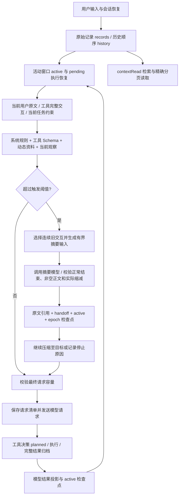

# 上下文系统完整调用链审查与修复记录

日期：2026-09-22。范围：Browser Chat 主会话和分支、原生 AI SDK 与 Codex action-object 两条执行路径。修复沿用现有数据模型和执行循环，没有增加针对具体页面、文件或业务用例的判断。

## 一、当前系统如何工作

| 调用环节 | 主要代码 |
| --- | --- |
| 会话接入、活动检查点、取消与分支 | `browser-chat.service.ts` |
| 原生 SDK / Codex 准备、工具回执、重试和派发 | `browser-chat-executor.agent.ts` |
| 记录引用、序列化、活动窗口恢复 | `browser-chat-model-context.ts` |
| 窗口配置和文本/图片估算 | `runtime-context-budget.ts` |
| 系统、消息、背景资料及观察的请求投影 | `runtime-context-assembler.ts` |
| 选批、固定原文、检查点、压缩停止与降级 | `runtime-context-runtime.ts` |
| 摘要输入、调用重试、结束原因、正文检查与宿主来源记录 | `runtime-semantic-summary.ts` |
| 工具调用和结果配对 | `runtime-context-compression.ts` |
| 原文关键词检索与指针定位 | `runtime-context-search.ts` |
| Skill 可见性、任务约束与资料状态 | `hidden-runtime-skills.ts`、`runtime-knowledge-context.ts`、`task-context.ts` |
| 待执行/执行中/已完成记录与中断恢复 | `runtime-execution-journal.ts` |
| 数据库拆分、恢复和同事务提交 | `storage/browser-chat-context-store.ts`、`storage/database-record-store.ts` |
| 压缩状态与请求/响应展示 | `BrowserChatLogDialog.tsx`、`browser-chat-log-model.ts`、`browser-chat-output-cycles.ts` |

未标注目录的运行时文件位于 `src/server/ai/agents`；展示文件位于 `src/components` 或 `src/lib`。

### 记录与请求不是同一份数据

- `records`：按内容哈希寻址的记录；完整工具返回先归档，再生成给模型的预览。用户顶层二进制附件不直接放入持久化文字记录，附件仍由文件注册表及原文件管理。
- `history`：原始事件的有序引用。同样的文字可以出现多次，不等于同一个用户事件。
- `active`：下一次模型执行的文字工作窗口；从检查点恢复，不用全量 history 重建。
- `continuationSummary`：保存 epoch、handoffRef 和压缩时的用户引用，不是另一份自然语言摘要正文。
- 请求清单：保存系统、工具 Schema、消息引用、估算量和压缩状态。动态资料及截图属于请求投影，不反复积累进 active。
- `taskContext`：任务状态、精确用户约束与有来源的工作笔记；摘要不能替代固定用户约束或改变业务验收结果。

### 输入容量和压缩

模型能力中配置的上下文大小优先，其次使用默认窗口配置。输入容量等于窗口减协议安全预留，默认预留 4096；没有应用层输出预算或输出 token 上限。

本次读取的持久化设置为窗口 256000、触发比例 0.85、目标比例 0.25、图片估算 1200、运行时请求超时 600000 ms。按默认安全预留计算，输入容量为 251904、触发线为 214118、目标为 62976。代码默认值、设置页和 `.env.example` 现已统一；实际模型的能力配置仍可覆盖默认窗口。

达到触发线后，选择最旧的连续完整交互，保留最近至少四块。摘要输入上限为 `min(18000, 输入容量)`，它是输入批次限制，不是模型输出预算。当前用户原文保留在 active；给摘要模型的当前请求仅作为相关性提示，使用不带二进制的有界投影。

每批摘要最多调用两次，每次准备最多八批。空正文或无缩减问题带反馈重试；临时网络等错误退避重试；截断、过滤、异常结束不会接受为有效摘要。相同失败批次在当前执行中不会反复请求，后续显示 skipped 而非新的失败调用。模型生成普通文本，宿主直接附加本批来源，来源不代表逐条事实已核实。保存每批成功结果后再继续；后续失败不会撤销已保存的有效批次。

### 工具与恢复

调用和结果是原子交互；请求修复核对调用 ID、工具名，去除重复结果。缺少耐久结果时提供未知结果回执，要求重新观察，不能默认未执行后直接重放。执行日志中尚未开始的决策与已经开始但结果未知的决策仍区分 `not-executed` 和 `unknown`。

`contextRead` 按本会话/分支可见记录读取；无 ref 为关键词搜索，有 ref 为精确指针与字符分页。原生模式与 Codex 模式共用 Schema 和读取实现。检索摘录不是完整读取，也不是当前页面状态。

## 二、本轮新增确认并修复的问题

| 问题与触发条件 | 后果 | 修复 |
| --- | --- | --- |
| 摘要直接序列化带图片的当前请求 | Buffer/base64 展开为巨大文本，选批后仍可能输入超限 | 当前请求与历史均使用摘要投影，排除媒体体 |
| 选批估算与实际提示词分别构造 | 输入边界或纠错重试时超限 | 共用提示词构造器，选批预留纠错空间，调用检查完整输入 |
| 删除持久化媒体后仍按旧数组下标生成指针 | `contextRead` 指向错误字段或读不到原文 | 按实际归档结构生成 ref 和 pointer，覆盖正文与工具内容片段 |
| 当前用户原文被摘要替换，只在发送时临时补回 | active 检查点缺少原文，恢复或后续准备可能退回旧请求 | 原文不进入有损摘要，随替换窗口持久化；缺失时恢复到历史交接后的边界 |
| 使用旧 handoff 的用户引用覆盖当前活动窗口的新用户输入 | 多轮任务可能采用上一轮请求判断相关性 | 优先选择当前活动窗口的最新真实用户消息，旧引用只用于缺失时恢复 |
| SDK 返回消息过滤后再按过滤前长度取增量 | 临时视觉消息存在时可能漏掉新回复或工具结果 | 按 SDK 原数组计算消费边界，之后再做视觉过滤与协议修复 |
| 附件绑定到最后一个 user 角色消息，且数组正文被替换 | 附件可能绑定到宿主记忆块，多段用户正文可能丢失 | 绑定到最新用户指令，保留全部已有文本片段 |
| 仅在 tool 角色查找工具结果 | 供应商在 assistant 中返回的已完成结果被误判不完整 | 两种结果位置都参与闭合判断 |
| 工具结果只按 ID 配对，不去重、不核对名称 | 重复或错工具结果进入模型请求 | 同时核对 ID 与工具名，重复结果仅保留一份 |
| 普通 JSON 包含 `type: file` / `data` | 被误当媒体，较大正文不计入容量 | 仅协议媒体位置排除媒体体，业务 JSON 正常计数 |
| 日志按脱敏展示对象估算，压缩按请求对象估算 | 通过准入和日志显示的 token 不一致 | 准入、缩减校验及发送日志统一按实际请求投影估算 |
| 可选背景使请求超限 | 即使删去可选资料即可容纳，也可能进入失败 | 优先移除可选低优先级资料，保留固定约束、用户原文和当前观察 |
| 摘要在主请求 watchdog 计时内运行 | 尚未发送主请求，主超时已被摘要耗尽 | 准备期间暂停主 watchdog，摘要保留独立超时和取消信号 |
| 供应商超限后只降低配置触发线 | 估算量低于配置线时，重试仍不触发压缩 | 根据刚被拒绝的实际请求大小降低触发线；无缩减则停止；成功推进后重置 |
| 压缩后刷新观察增加请求大小 | 实际未达目标仍可能留下完成状态 | 刷新后重新判定目标状态，返回明确的 limited 原因 |
| Codex 分支没有注册/分发 `contextRead` | 摘要有原文引用却没有读取入口 | 注册工具、公布同一 Schema、接入真实读取实现 |
| Codex 部分回执只写展示文字，调用与 trace 使用不同 ID | 后续模型和证据引用拿不到真实工具结果 | 实际返回进入归档，活动窗口按统一规则投影，日志/决策/回执使用同一 ID |
| 通用结果预览裁掉前置检查返回的完整 Skill | 下一步仍缺正文，出现重复前置检查 | 分页与完整当前 Skill 回执保留；普通结果仍可生成引用预览 |
| Codex 按历史读取日志保留 Skill 已加载状态 | 压缩后正文不在上下文，却仍视为已加载 | 两条执行路径都按实际在场正文判定 |
| 恢复代码过滤掉缺失引用或非法消息 | 表面恢复成功，实际上静默丢失上下文 | 明确报错；恢复引用校验扩展到分支、请求清单、handoff 和用户引用 |
| 活动检查点在取消后提前返回 | 调用方可能继续清除 pending 执行记录 | 提交前后检查轮次有效性，未提交不确认清除 |
| 后端默认比例与设置页不一致，Skill 保留阈值没有消费方 | 相同“默认配置”可能行为不同，设置看似有效却不生效 | 统一为 0.85 / 0.25，移除无效阈值设置及示例 |

前一轮已修复的日志问题继续保留：模型返回不等于压缩成功；校验与耐久保存后才发布完成；失败降级、部分完成和未达目标分别显示，不把 `{}` 包装成成功摘要。

### 后续真实会话暴露的摘要契约问题

`chat_24a36d123e4b` / `msg_dc216618da58` 的失败详情表明，模型正常以 stop 结束，返回 3265 字符，却被旧的逐条来源校验拒绝。原实现把当前请求、历史外层引用及记录内部引用一起提供给模型，校验仅允许本批历史外层引用，任意一条来源不匹配即可拒绝整份摘要；facts 和 decisions 同时为空也触发同一报错。只读检查时原始摘要响应已不在现存日志中，无法确认具体触发项。第 53、54 次执行事件复用了失败缓存，不能算作新的摘要请求。

此前内联检查验证了符合预设 JSON 契约的响应，没有覆盖真实模型的来源表达变化。这是机制验证的遗漏。现移除模型逐条引用和 JSON 契约，改为普通文本摘要及宿主维护的批次来源；保留正常结束、有效正文、完整请求实际缩减、持久化成功要求。空白、空对象和纯标点响应不会被接受。失败详情保留有限摘要预览，缓存复用使用独立 skipped 事件。该修正消除来源格式造成的整批拒绝，不声称自动证明摘要语义完整。

此项修正的九组内联检查通过：普通文本保存与宿主来源、模型文本不能覆盖来源、空输出拒绝与一次纠错、异常结束拒绝、缩减与用户原文保留、失败缓存不重复调用、不缩减拒绝、检查点失败、skipped 日志分类。后端类型检查、三个相关前端文件的定向类型检查、全部已修改 TypeScript 的 ESLint 与 diff 空白检查通过；没有创建测试文件或启动 dev/build，未重新调用真实模型验证该会话。

## 三、检查过且保留的机制

- 系统规则和工具 Schema 计入容量；必需任务约束不会为满足目标而静默删除。
- 保存 handoff、active、epoch 与压缩审计沿用同一会话写事务。归档写入缓存只在提交成功或成功读取后更新。
- 中断恢复沿用持久化 pending 和 CAS revision，不从缺少结果推断业务成功。
- 原始工具完整结果与模型有界预览分开；精确分页结果不能再次裁剪后保留旧 nextOffset。
- 用户明确配置的供应商请求参数仍由模型配置层处理；本轮没有重新加入输出预算。
- 任务、工作流、摘要均不能将“工具调用成功”提升为业务验收通过。

## 四、验证证据与边界

没有新增测试文件，没有启动 dev/build，没有修改正在运行的会话数据库。

- 后端 `tsconfig.backend.json --noEmit` 通过；9 个修改涉及的前端文件定向类型检查通过；全部修改 TypeScript 文件 ESLint 与 `git diff --check` 通过。未将定向检查表述为整个仓库所有历史测试通过。
- 内联生产模块检查覆盖 15 组场景：媒体排除、引用读回、容量计算、工具配对、非法恢复拒绝、多批压缩、固定原文、纠错重试、取消、保存失败、异常结束、同批失败缓存、可选资料淘汰、原文恢复、观察刷新与内联工具结果。
- 只读恢复 `chat_3538f83eeba8` 的 445 条记录和 `chat_24a36d123e4b` 的 227 条记录：672 条均通过内容哈希、引用与消息结构检查。故意缺失的分支引用被拒绝。
- 提取实际执行器函数进行内联验证：Codex 原文读取与参数校验、调用 ID 一致、视觉过滤前的响应边界、多段用户正文和附件绑定。
- 附加边界验证：完整 Skill 前置回执保留、摘要不冒充已加载 Skill、精确分页不二次裁剪、实际 60000-token 请求被拒绝时将重试触发线降到 45000、无缩减停止、摘要准备不消耗主 watchdog 超时。

这些检查验证代码机制与真实记录的恢复，不证明真实模型摘要的语义保真，也不替代真实供应商和浏览器端到端验证。Token 仍是启发式估算，供应商 tokenizer 和媒体计费可能不同；供应商实际拒绝时走有进展的压缩重试。摘要是有损历史，精确约束与证据应通过固定原文、taskContext 及 contextRead 保留/取回。若当前请求和必须保留的近期交互本身超过模型容量，系统会明确停止，而非伪造压缩成功。
